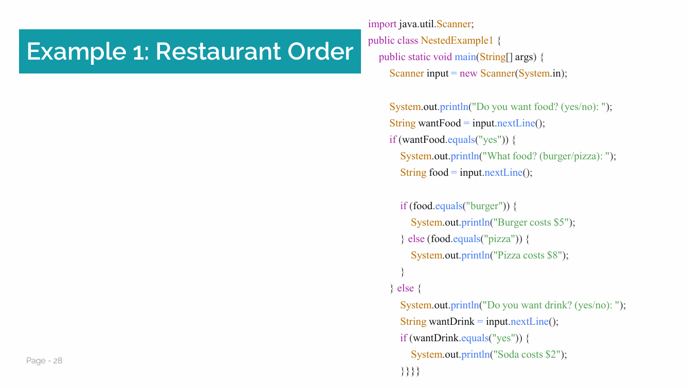
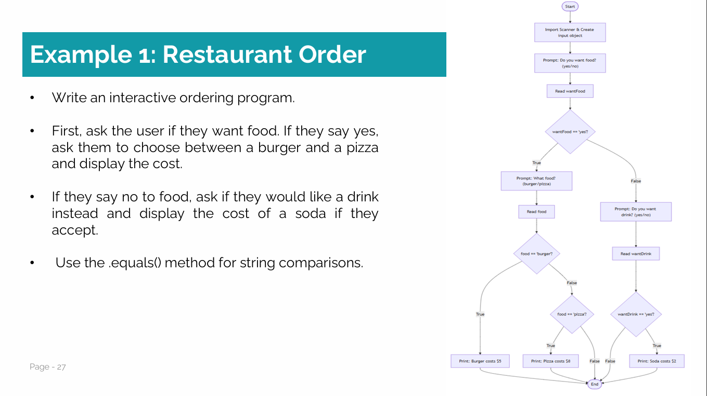

# ☕ Advanced Coffee Shop Order System (Java – Week 01 Assignment)

This repository contains an **enhanced version of a simple Java assignment** from  
**Week 01 (OOP Basics)**.  
Although the original task was very basic, I chose to **extend and improve it for learning purposes**.

> ⚠️ This is **not a full project**, but a **small university assignment** that I developed beyond the minimum requirements.

---

## 📌 Assignment Description (Original Task)

The original assignment required:
- Asking the user if they want **food**
- Letting them choose between **burger or pizza**
- Displaying the price
- Using basic `if / else` statements and `.equals()` for comparison

---

## 🚀 My Enhancements

Even though this was a **simple Week 01 assignment**, I decided to improve it by:

✅ Expanding the choices to **Food or Drink**  
✅ Adding **nested decision logic**  
✅ Supporting **Hot & Cold drinks**  
✅ Making input **case-insensitive** using `.toLowerCase()`  
✅ Handling invalid inputs with user-friendly messages  
✅ Improving code readability and structure  

These changes were made to **practice Java logic and problem-solving**, not because they were required.

---

## 🧠 Program Flow

1. Ask the user if they want **food or drink**
2. If **food**:
   - Choose between **Pizza** or **Burger**
3. If **drink**:
   - Choose **Hot** or **Cold**
   - Select a specific drink
4. Display the price
5. Handle invalid inputs
6. End with a thank-you message

---

## 🖼 Reference Images

### Original Assignment (University Slides)

### Logic Flowchart

---

## 💻 Technologies Used

- Java
- Scanner Class
- Conditional Statements
- String comparison (`equals`)
- Input normalization (`toLowerCase`)

---

## 🎯 Why I Did This

This assignment helped me:
- Practice Java fundamentals
- Understand nested conditions better
- Go beyond the minimum academic requirement
- Build the habit of improving simple tasks

---

## 👤 Author

**Beshoy Khalil**  
Cybersecurity Student  
Java & Programming Learner  

🔗 GitHub: https://github.com/Beshoy2Khalil

---

## ⭐ Note

This repository represents **personal improvement on a basic academic assignment**, not a full-scale application.